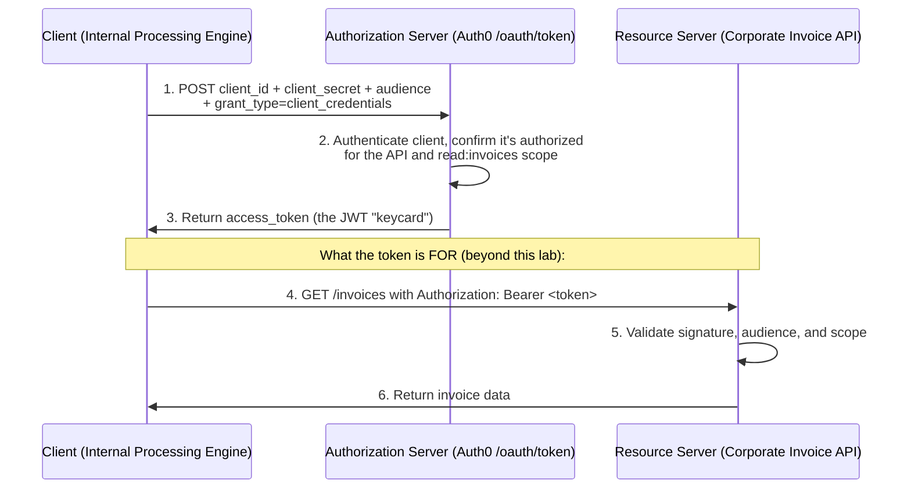

# OAuth 2.0 Machine-to-Machine (Client Credentials) Lab

A hands-on lab where I protected an API with Auth0, registered a backend client, and used the **OAuth 2.0 Client Credentials flow** to request an **access token** — then decoded it to prove the core distinction in IAM: this token grants *access*, and carries no user identity at all.

This is the third in a set with my [SAML 2.0 lab](../saml-sso-lab) and [OIDC lab](../oidc-sso-lab). Together they cover the full picture: SAML and OIDC handle **authentication** (who you are); OAuth 2.0 handles **authorization** (what you're allowed to do).

---

## What this demonstrates

- The authentication vs. authorization distinction, proven end to end
- OAuth 2.0 **Client Credentials** (machine-to-machine) flow
- Protecting an API as a Resource Server and defining granular scopes
- Reading an access token and understanding what it does — and doesn't — contain

---

## Background: the golden rule of IAM

**OIDC is for authentication (identity). OAuth 2.0 is for authorization (access).**

The way I think about it: OAuth 2.0 is a **hotel keycard**. The card doesn't know your name — it only knows you're allowed to open Room 402. An access token works the same way. It doesn't say *who* the caller is; it says *what* the caller is permitted to do, and *to which resource*.

To make that concrete I used the **Client Credentials flow** (also called **machine-to-machine / M2M**). This is how backend systems authenticate *themselves* and talk to each other securely — no user, no login, no browser. The client proves its identity with a secret and receives a token scoped to a specific API.

The parties:
- **Resource Server (the API)** — "Corporate Invoice API," the protected thing.
- **Client** — "Internal Processing Engine," the backend that needs a keycard.
- **Authorization Server** — **Auth0**, which issues the tokens.

---

## Tools used

| Role | Tool |
|------|------|
| Authorization Server | Auth0 |
| API request client | [Hoppscotch](https://hoppscotch.io/) |
| Token inspection | [jwt.io](https://jwt.io/) |

---

## The flow (Client Credentials)

Notice there's no user and no browser redirect — it's pure server-to-server.



*This lab covers steps 1–3 (obtaining and decoding the token). Steps 4–6 are what the token is ultimately used for.*

---

## Walkthrough

### Step 1 — Created the API (the Resource Server)

In Auth0 I went to **Applications → APIs → Create API** and set it up:
- **Name:** `Corporate Invoice API`
- **Identifier (Audience):** `https://api.mycompany.com/invoices`

The identifier is the API's **audience** — its unique name. It doesn't have to be a real, reachable URL; it's just the label a token will be scoped to. When a token is issued "for" this audience, only this API should accept it.

Then on the **Permissions** tab I defined a scope, `read:invoices`, with a description. Scopes are the granular permissions the API exposes — the individual "rooms" a keycard might be allowed to open. Defining them here lets me grant least-privilege access instead of all-or-nothing.

### Step 2 — Created the backend client

Rather than use a pre-made test app, I built the actual client that needs access. Under **Applications → Applications → Create Application**, I named it `Internal Processing Engine` and chose **Machine to Machine Applications** as the type — the app type that has no user and authenticates with a secret.

Auth0 immediately asked which API this machine may access. I selected **Corporate Invoice API**, checked the **`read:invoices`** scope, and clicked **Authorize**. That step is the actual grant: it's what makes the authorization server willing to issue this specific client a token for this specific API and permission.

### Step 3 — Requested the access token

Now I acted as the backend server making the token request. Using **Hoppscotch** as an API client, I:
- set the method to **POST**,
- pointed it at Auth0's token endpoint, `https://YOUR_DOMAIN/oauth/token`,
- set the body content type to **`application/json`**, and
- sent the client's credentials and request:

```json
{
  "client_id": "YOUR_CLIENT_ID",
  "client_secret": "YOUR_CLIENT_SECRET",
  "audience": "https://api.mycompany.com/invoices",
  "grant_type": "client_credentials"
}
```

The `grant_type: client_credentials` is what selects the M2M flow. The `client_secret` is the machine's password — it's how the client proves it really is the Internal Processing Engine. (If Hoppscotch throws a "Network Failed" error, switching from Browser to **Proxy** in its failure dialog resolves it.)

Auth0 validated the secret, confirmed the client was authorized for that audience and scope, and responded with an **`access_token`**.

### Step 4 — Decoded the token (the "aha" moment)

I copied the access token and pasted it into [jwt.io](https://jwt.io/). Because I'd requested a token for a custom API audience, Auth0 returned a readable JWT rather than an opaque string.

Here's the payoff. Unlike the ID Token from my OIDC lab — which was full of *identity* (`name`, `email`) — this access token contains **no user information whatsoever**. Its claims are about **access**:

- `iss` — the issuer (Auth0).
- `sub` — the **subject is the machine itself**, formatted like the client ID (e.g. `...@clients`), not a person. Nobody logged in; the *application* is the principal.
- `aud` — the audience, `https://api.mycompany.com/invoices`. This token is only valid for the Corporate Invoice API.
- `scope` — `read:invoices`. This is the keycard telling the API exactly which door it opens.
- `azp` / `gty` — the authorized party (the client) and grant type (`client-credentials`).
- `exp` / `iat` — the token's lifetime.

That's the hotel keycard, proven: the card says *which room* (audience) and *what you can do there* (scope), and it deliberately doesn't say your name.

---

## Key takeaways

- **Authentication and authorization are different problems.** The ID Token in my OIDC lab answered "who is this user?"; this access token answers "what may this client do?" — and it carries zero identity to make the point.
- **The Client Credentials flow is how backends talk securely** with no user in the loop — the client authenticates with a secret and gets a scoped token.
- **`audience` + `scope` are the whole security model of an access token**: which resource it's valid for, and which permissions it grants. An API should always validate both, not just the signature.
- **The client secret is a real credential.** In production it lives only on the backend server and never in source control or a browser — the same handling discipline as any password or key.

---

## Possible next steps

- Actually **call the Corporate Invoice API** with the token as a `Bearer` credential and enforce the `read:invoices` scope on the API side.
- Add a `write:invoices` scope and show how a token *without* it gets rejected — demonstrating least privilege in action.
- Inspect Auth0's **JWKS endpoint** and validate the access-token signature programmatically.
- Contrast this end to end with the [OIDC lab](../oidc-sso-lab): same authorization server, one token about *identity*, one about *access*.
